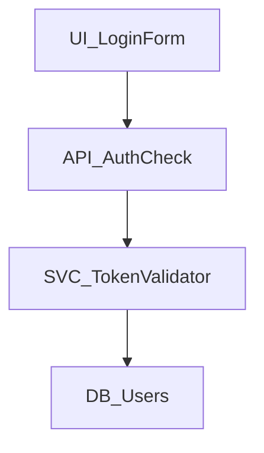

# Noderr

Your AI already knows how to code. Noderr teaches it how to engineer.

---

## Documentation

- **[Getting Started](./docs/noderr_getting_started.md)** - Complete user guide and first steps
- **[Understanding Noderr](./docs/understanding-noderr.md)** - Deep dive into concepts and architecture  
- **[Prompts Guide](./docs/noderr_prompts_guide.md)** - Command reference for all workflows (essential reading!)
- **[System Guide](./docs/noderr_guide.md)** - Visual roadmap of files and structure
- **[Installation](./INSTALL.md)** - Detailed setup instructions

## Getting Started

### Prerequisites
- Any AI assistant that can read/write files (ChatGPT, Claude, Cursor, etc.)
- Basic familiarity with AI-assisted coding
- A project (new or existing)

### Installation

1. **Download Noderr**
   - Download the latest release: [noderr-starter.zip](https://github.com/kaithoughtarchitect/noderr/releases/latest/download/noderr-starter.zip)
   - Extract the ZIP file into your project directory

2. **Initialize Your Environment** ⚠️ **CRITICAL STEP**
   - Open `noderr/environment_context.md`
   - Fill in EVERY section with your specific setup (OS, tools, commands)
   - **The AI cannot function until this is complete** - it needs to know HOW to work in your environment
   - This is like giving the AI a driver's license for your system

3. **Start Your First Session**
   ```
   You: Use the prompt "NDv1.9__Start_Work_Session.txt"
   AI: "I've synced with your project. Ready for your PrimaryGoal."
   
   You: "Add user authentication"
   AI: "I'll analyze the impact. Use prompt LOOP_1A to continue..."
   ```

## The Noderr Difference

Noderr gives AI what every senior developer has: **permanent memory** and **system understanding**.

### 1. Building Blocks with Identity (NodeIDs)

Every piece of your system gets a unique, permanent name:
- `UI_LoginForm` - That specific login form
- `API_AuthCheck` - That specific authentication endpoint  
- `SVC_TokenValidator` - That specific validation service

Unlike traditional AI coding where the AI forgets what it built between conversations, NodeIDs give each building block a permanent identity that persists forever.

**The Impact:** Instead of "update the login", you can say "update `API_AuthCheck`" and the AI knows EXACTLY what you mean, even months later.

### 2. Visual Architecture That Remembers

These NodeIDs aren't just labels - they live in a visual map (Mermaid diagram) that shows:
- **WHERE** each piece fits in your system
- **HOW** it connects to other pieces
- **WHAT** depends on it



The AI uses this visual memory to understand that changing `API_AuthCheck` will affect both the login form above it and the validator below it.

### 3. Blueprints for Every Building Block (Specifications)

Each NodeID has its own detailed blueprint in the `specs/` folder. These contain:
- Purpose and responsibilities
- Dependencies and interfaces
- Core logic and behavior
- Verification criteria
- Technical debt notes

### 4. Lightning-Fast Context Assembly

When you say "Fix the login timeout issue", here's what happens:

1. AI looks at the visual architecture
2. Finds `API_AuthCheck` and sees all connections
3. Reads only the relevant specs
4. Has perfect understanding in seconds

No more loading entire codebases or missing critical connections.

### 5. Mission Control Dashboard (Tracker)

See everything at a glance:

| Status | WorkGroupID | NodeID | Dependencies | Progress |
|:---|:---|:---|:---|:---|
| 🟢 | - | UI_LoginForm | - | VERIFIED |
| 🟡 | feat-20250107-143022 | API_AuthCheck | UI_LoginForm | WIP |
| ⚪️ | - | API_PasswordReset | API_AuthCheck | TODO |

Track what's done, what's in progress, what's blocked, and what's next.

### 6. Perfect Historical Memory (Log)

Every significant action is permanently recorded:
- What was built and when
- Why decisions were made
- What problems were discovered
- What technical debt was created

The AI can answer "Why does this code look weird?" with "According to the log, we had to work around a third-party API limitation on Jan 15."

## Core Concepts in 30 Seconds

### 🏷️ **NodeIDs - Permanent Identity**
Every building block gets a unique name (like `API_AuthCheck` or `UI_LoginForm`) that persists across all AI sessions forever. No more "what login are you talking about?"

### 📦 **Change Sets - Complete Updates**
AI identifies ALL NodeIDs affected by a feature and updates them together. No more partial implementations that break other features.

### 🗺️ **Visual Architecture - Spatial Memory**  
NodeIDs live in a Mermaid diagram showing how everything connects. AI sees your system as an architect would - not as random files.

### 📋 **Living Specifications**
Each NodeID has a detailed blueprint (spec) that evolves from plan → built → verified. AI always knows what each NodeID should do.

### 📊 **Real-Time Mission Control**
The tracker dashboard shows exactly what's done, what's in progress, and what's blocked - with WorkGroupIDs that track related changes together.

## How is Noderr Different?

| Traditional AI Coding | Noderr |
|----------------------|-------------|
| "Add login feature" → AI writes some login code somewhere | "Add login feature" → AI identifies all affected NodeIDs, shows system impact, builds everything together |
| "Update the auth system" → "What auth system? I don't see one" | "Update API_AuthCheck" → AI knows exactly what you mean, sees all connections |
| Files and functions with no permanent identity | Every building block has a NodeID that persists forever |
| AI reads entire codebase each time (or misses connections) | AI uses visual architecture to instantly find relevant specs |
| Changes break other features → discover during testing | AI sees ripple effects before coding → builds complete Change Sets |
| "I'll add error handling" → Inconsistent patterns | ARC Verification ensures every NodeID meets quality gates before completion |
| Context lost between sessions → repetitive explanations | Perfect memory via log → "Per the Jan 15 entry, we worked around API limitation" |
| Technical debt accumulates invisibly | Every debt logged → REFACTOR_NodeID tasks auto-scheduled |
| Documentation drifts from reality | Specs updated to "as-built" state after every change |
| Each feature built in isolation | Visual architecture ensures system cohesion |

## Critical Concepts You Need to Know

### The Environment Context (Your AI's Driver's License)
**This is CRITICAL**: The AI cannot function without `environment_context.md` being filled out. This file teaches the AI:
- What commands to use on YOUR system (npm vs yarn, python vs python3)
- How to run tests in YOUR setup
- Where YOUR database lives
- How to commit code in YOUR environment

Think of it as the AI's driver's license - without it, the AI knows WHAT to do but not HOW to do it on your machine.

### The Prompts System (Your Control Panel)
You don't just chat with the AI. You use specific prompt files to trigger each phase:
```
NDv1.9__Start_Work_Session.txt         → Begin work
NDv1.9__[LOOP_1A]__Propose_Change_Set.txt → Start a feature
NDv1.9__[LOOP_1B]__Draft_Specs.txt    → Review specs
NDv1.9__[LOOP_2]__Implement_Change_Set.txt → Build it
NDv1.9__[LOOP_3]__Finalize_And_Commit.txt → Finish up
```

Each prompt ensures the AI follows the exact methodology, every time.

### ARC Verification (Quality Gates)
**A**ttentive **R**eview & **C**ompliance - Before marking any NodeID as complete, the AI verifies:
- All tests pass
- Code meets security standards
- Performance is acceptable
- Error handling is robust
- Documentation matches reality

This isn't just "does it run?" - it's "is it production-ready?"

## The Noderr Loop

Every feature follows this systematic 4-step process:

**Step 1A: Impact Analysis**
```
You: "Add password reset"
AI: "This requires changing:
     - NEW: UI_ResetForm, API_ResetPassword
     - MODIFY: UI_LoginPage (add 'forgot password' link)
     - MODIFY: DB_Users (add reset_token field)"
```
→ Use prompt: `NDv1.9__[LOOP_1A]__Propose_Change_Set.txt`

**Step 1B: Draft Specs**
- AI marks NodeIDs as Work-In-Progress (WIP)
- Creates detailed blueprints for every affected NodeID
- You review the specifications
→ Use prompt: `NDv1.9__[LOOP_1B]__Draft_Specs.txt`

**Step 2: Implement Change Set**
- AI builds ALL NodeIDs in the Change Set together
- Runs tests and verification
- Ensures quality gates are met
→ Use prompt: `NDv1.9__[LOOP_2]__Implement_Change_Set.txt`

**Step 3: Finalize & Commit**
- Updates all specs to match what was built
- Logs decisions and discoveries
- Creates a clean git commit
→ Use prompt: `NDv1.9__[LOOP_3]__Finalize_And_Commit.txt`

## The Noderr Loop in Action

```
You: "Add password reset" 
         ↓
1A. 🔍 AI analyzes impact → "This affects UI_LoginPage, API_ResetPassword, DB_Users, SVC_EmailService"
    You: "Approved" ✓
         ↓
1B. 📋 AI drafts blueprints → Creates specs for each NodeID
    You: Review specs → "Looks good" ✓
         ↓
2.  🔨 AI implements everything → Builds all NodeIDs together, runs tests
         ↓
3.  📝 AI finalizes → Updates specs to match code, logs decisions, commits
         ↓
🎉 Complete feature with perfect memory for next session
```

**The Reality**: You guide AI through structured gates, ensuring quality at each step.

## What Gets Created

```
your-project/
├── 📁 noderr/
│   ├── 📄 noderr_project.md      # Your project's vision & standards
│   ├── 🗺️  noderr_architecture.md # Visual system map  
│   ├── 📊 noderr_tracker.md      # Progress dashboard
│   ├── 📝 noderr_log.md          # Development history
│   └── 🔧 noderr_loop.md         # AI's instruction manual
├── 📁 specs/                     # Blueprints for each NodeID
├── 📁 planning/                  # Feature analysis docs
└── 📄 environment_context.md     # Your environment setup
```

## Real Example

**Without Noderr:**
```javascript
// Monday: "Add user profile"
function UserProfile() { ... }

// Wednesday: "Add user settings"  
function Settings() { ... }  // New component, doesn't connect

// Friday: "Make profile show settings"
// AI: "I don't see how these relate..."
```

**With Noderr:**
```javascript
// Monday: "Add user profile"
// You: Use prompt "NDv1.9__[LOOP_1A]__Propose_Change_Set.txt"
// AI: "Creating UI_UserProfile (NodeID), updating UI_Navigation to include 
//      profile link, adding API_GetProfile endpoint. All connected in architecture."

// Wednesday: "Add user settings"
// AI: "I see UI_UserProfile exists. Creating UI_UserSettings as child component,
//      adding to architecture, creating API_UpdateSettings, updating tracker."

// Friday: "Make profile show settings"  
// AI: "I see both in the architecture. They're already connected. 
//      Just need to update UI_UserProfile render method. One-line change."
```

Without Noderr: AI might just add a password field somewhere and call it done.

## License

MIT License - Use freely in your projects

## The Bottom Line

Noderr transforms AI from an eager intern who writes random code into a disciplined engineer who understands your system, follows your standards, and builds with purpose.

Welcome to systematic AI development. Welcome to Noderr.

---

*Because great software isn't just coded. It's engineered.*
