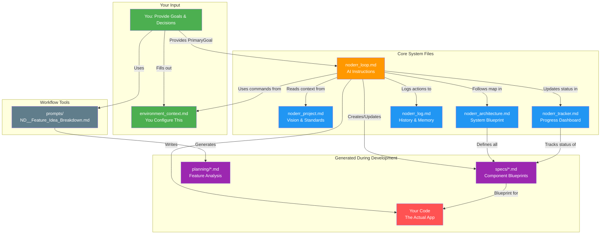
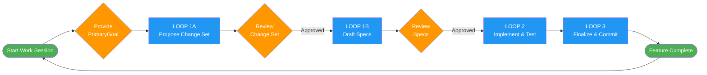

# Noderr Visual Guide

*Your visual roadmap to understanding the Noderr ecosystem.*

This guide illustrates the file structure and workflow of a Noderr project, showing how all components work together to create a systematic development environment.

Navigate with confidence through every file, folder, and workflow in a Noderr project.

---

### How Noderr Components Work Together

---

### At a Glance

Noderr transforms chaotic AI development into a systematic, maintainable process through a carefully orchestrated file system. This guide is your architectural blueprint—showing you exactly what lives where and why it matters.

---

### Core Architecture Overview

| Path | Description |
| :--- | :--- |
| 📁 `noderr/` | ← The System's Core Documents |
| ├── `noderr_project.md` | The Project's Constitution & Vision |
| ├── `noderr_architecture.md` | The Visual System Blueprint |
| ├── `noderr_tracker.md` | The Live Progress Dashboard |
| ├── `noderr_loop.md` | The AI Agent's Operational Manual |
| └── `noderr_log.md` | The Project's Immutable History |
| | |
| 📄 `environment_context.md` | ← The Agent's Tactical "Driver" |
| | |
| 📁 `specs/` | ← The Blueprint Library for Components |
| └── `[NodeID].md` | Individual Component Contracts |
| | |
| 📁 `planning/` | ← Strategic & Brainstorming Artifacts |
| └── `feature_breakdown_...md`| Feature Analysis Reports |
| | |
| 📁 `prompts/` | ← The Orchestrator's Command Toolkit |
| └── `ND__*.md` | Workflow & Loop Templates |

---

### The Core Documents: `/noderr`

The brain of your operation—five essential files that orchestrate strategy.

**`noderr_project.md`** - The Project Constitution
*   **Purpose:** Defines the project's DNA: its vision, goals, tech stack, and coding standards.

**`noderr_architecture.md`** - The Visual Blueprint
*   **Purpose:** An interactive system flowchart showing all components (`NodeID`s) and their connections.

**`noderr_tracker.md`** - The Live Dashboard
*   **Purpose:** Provides real-time progress monitoring of all nodes.
*   **Key Columns:** `Status`, `WorkGroupID` (for active work), `Dependencies`.

**`noderr_loop.md`** - The AI's Playbook
*   **Purpose:** The AI agent's primary instruction manual, detailing the step-by-step development process.

**`noderr_log.md`** - The Project's Memory
*   **Purpose:** A complete, chronological history of all significant decisions, actions, and outcomes.

---

### The Core Files: Root Directory

**`environment_context.md`** - The Tactical "Driver"
*   **Purpose:** Translates the abstract goals from `noderr_loop.md` into concrete, platform-specific commands.
*   **Your Role:** You, the user, must fill this file out to tell the agent *how* to operate in your specific environment (e.g., how to run tests, commit code, etc.). **The system cannot function without it.**

**`/specs`** - The Blueprint Library
*   **Purpose:** Contains detailed blueprints (`[NodeID].md`) for every single component in the system. Each spec is a contract that is drafted before building and finalized to an "as-built" state after verification.

**`/planning`** - The Strategy Room
*   **Purpose:** A directory to store strategic planning documents generated by prompts like `ND__Feature_Idea_Breakdown.md`. These artifacts help shape the roadmap before work officially begins.

---

### The Noderr Lifecycle

**Phase 1: Genesis (New Project)**
1.  **Prepare your vision** → Create blueprint, project overview, and architecture
2.  **Build initial prototype** → AI creates the first version
3.  **`ND__Install_And_Reconcile.md`** → Install Noderr and reconcile with actual build

**Phase 2: Development (The Loop)**
1.  **`ND__Start_Work_Session.md`** → Agent syncs up and is ready for a `PrimaryGoal`.
2.  **You provide a `PrimaryGoal`**.
3.  **The 4-Step Loop Begins:**
    *   `[LOOP_1A] Propose Change Set`
    *   `[LOOP_1B] Draft Specs`
    *   `[LOOP_2] Implement Change Set`
    *   `[LOOP_3] Finalize & Commit`
4.  Repeat for the next `PrimaryGoal`.

---

### Quick Navigation Guide

| I want to... | Look at... |
| :--- | :--- |
| Understand the project's vision | `noderr/noderr_project.md` |
| See the big picture | `noderr/noderr_architecture.md`|
| Check project progress | `noderr/noderr_tracker.md` |
| Find a component's details | `specs/[NodeID].md` |
| Review project history | `noderr/noderr_log.md` |
| Know how the agent works | `noderr/noderr_loop.md` |
| See how to run commands | `environment_context.md` |
| Plan future features | `planning/` directory |

---

### File Creation and Ownership

**Human-Created Files:**
- `environment_context.md` - Must be filled out for each development environment

**Noderr-Generated Initial Files:**
- All files in `noderr/` directory
- Empty `specs/` and `planning/` directories

**Files Generated During Development:**
- `specs/[NodeID].md` - Created as components are designed
- `planning/feature_breakdown_*.md` - Created during planning sessions
- Application source code - Created by AI following the Noderr process

---

The Noderr system separates strategy (`noderr/` files) from tactics (`environment_context.md`), creating a powerful, portable, and professional framework for AI-driven development.
