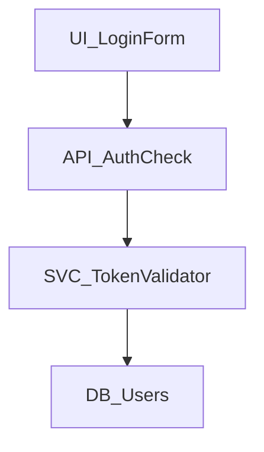

# Understanding Noderr: The Node-Based AI Coding System

## What Makes Noderr Different

### 1. Building Blocks with Identity (NodeIDs)

Every piece of your system gets a unique, permanent name - we call these **NodeIDs**:

- `UI_LoginForm` - That specific login form
- `API_AuthCheck` - That specific authentication endpoint  
- `SVC_TokenValidator` - That specific validation service
- `DB_UpdateUser` - That specific database operation

Unlike traditional AI coding where the AI forgets what it built between conversations, NodeIDs give each building block a permanent identity that persists forever.

**Think of it like this**: Instead of telling AI "update the login", you can say "update `API_AuthCheck`" and it knows EXACTLY what you mean, even months later.

### 2. Visual Architecture That Remembers

These NodeIDs aren't just labels - they live in a visual map (Mermaid diagram) that shows:
- **WHERE** each piece fits in your system
- **HOW** it connects to other pieces
- **WHAT** depends on it



The AI uses this visual memory to understand that changing `API_AuthCheck` will affect both the login form above it and the validator below it.

**Why This Changes Everything:**

Traditional AI: "Here's a login function" → Next session: "What login function?"

Noderr AI: "I see `UI_LoginForm` connects to `API_AuthCheck` which validates through `SVC_TokenValidator`" → Always remembers the entire system

### 3. Blueprints for Every Building Block (Specifications)

Each NodeID has its own detailed blueprint file in the `specs/` folder:
- `UI_LoginForm` → `specs/UI_LoginForm.md`
- `API_AuthCheck` → `specs/API_AuthCheck.md`

These specs contain everything the AI needs to know:
- **Purpose**: What this building block does
- **Dependencies**: What it needs to work
- **Interfaces**: How it connects to other blocks
- **Core Logic**: How it should behave
- **Verification Criteria**: How to test it works
- **Technical Debt**: What needs improvement later

### 4. Lightning-Fast Context Assembly

Here's the magic of how it all works together:

1. **You say**: "Fix the login timeout issue"

2. **AI looks at the architecture**: 
   - Finds `API_AuthCheck` in the visual map
   - Sees it connects to `UI_LoginForm`, `SVC_TokenValidator`, and `DB_Users`

3. **AI reads the relevant specs**:
   - Instead of searching through hundreds of files
   - It knows EXACTLY which specs to read
   - Gets clean, structured context immediately

4. **AI has perfect understanding**:
   - Knows what each piece does
   - Knows how they connect
   - Knows what changes are safe to make

### 5. Your Mission Control Dashboard (noderr_tracker.md)

Think of this as your project's control center - everything visible at a glance:

| Column | What It Reveals |
|:---|:---|
| **Status** | ⚪️ TODO, 📝 NEEDS_SPEC, 🟡 WIP, 🟢 VERIFIED, ❗ ISSUE |
| **WorkGroupID** | Which features are being built together (e.g., `feat-20250107-143022`) |
| **NodeID** | The unique building block identifier |
| **Label** | Human-friendly name |
| **Dependencies** | What must be built first |
| **Logical Grouping** | System category (Auth, Payments, UI, etc.) |
| **Spec Link** | One-click access to blueprints |
| **Classification** | Risk level (Standard/Complex/Critical) |
| **Notes/Issues** | Important warnings or blockers |

#### The Hidden Intelligence

**See What Changes Together:**
```
| Status | WorkGroupID | NodeID | Label |
|:---|:---|:---|:---|
| 🟡 | feat-20250107-143022 | UI_LoginForm | Login Form |
| 🟡 | feat-20250107-143022 | API_AuthCheck | Auth Endpoint |
| 🟡 | feat-20250107-143022 | SVC_TokenValidator | Token Service |
```
All three are being built as one coordinated change!

**Know Your Risk Levels:**
- 🟢 **Standard**: Regular features
- 🟡 **Complex**: Needs extra attention  
- 🔴 **Critical**: Security, payments, or core stability

**Track Real Progress:**
- See overall completion percentage
- Know what's blocking what
- Identify technical debt (REFACTOR_ tasks)
- One-click access to any component's details

### 6. Your Project's Flight Recorder (noderr_log.md)

Think of this as your project's **permanent memory** - a detailed history of every important decision, change, and event:

#### What Gets Logged

Every significant action creates a timestamped entry:

- **🚀 SystemInitialization**: Project started
- **📋 SpecApproved**: Blueprint for `API_AuthCheck` approved
- **✅ ARC-Completion**: Login feature built, tested, and verified
- **🔧 MicroFix**: Fixed typo in error message
- **❗ Issue**: API timeout discovered, investigating
- **♻️ RefactorCompletion**: Optimized database queries
- **🎯 FeatureAddition**: Payment system scope added

#### The Power of History

**Traditional AI:** 
- "Why does this code look weird?" 
- AI: "I don't know, I didn't write it"

**With Noderr's Log:**
- "Why does this code look weird?"
- AI: "I can see from the log that on Jan 15, we had to work around a third-party API limitation"

#### Real Example Entry

```markdown
---
**Type:** ARC-Completion
**Timestamp:** 2025-01-07T14:30:22Z
**WorkGroupID:** feat-20250107-143022
**NodeID(s):** UI_LoginForm, API_AuthCheck, SVC_TokenValidator
**Details:**
Successfully implemented and verified the Change Set for user authentication.
- **ARC Verification Summary:** All security criteria met, 15 tests passing
- **Architectural Learnings:** Discovered need for rate limiting
- **Unforeseen Ripple Effects:** UI_Dashboard needs update for new auth state
- **Technical Debt Created:** REFACTOR_API_AuthCheck (optimize token generation)
---
```

From this single entry, future AI sessions know:
- What was built together
- When it happened
- What was discovered during building
- What technical debt was created
- What else needs attention

#### The Hidden Second Purpose: Quality Standards

The log also contains your project's **quality criteria** - the standards every piece of code must meet:

- **Reliability**: Error handling, fault tolerance
- **Security**: Input validation, authentication
- **Performance**: Response times, resource usage
- **Maintainability**: Code clarity, documentation

This ensures the AI doesn't just build features - it builds them RIGHT, according to your project's specific standards.

### 7. The Noderr Loop - The Engine That Runs Everything

The Loop is how your AI transforms from a chaotic coder into a systematic engineer. Each prompt is like a checkpoint that ensures quality at every stage.

#### 🚀 Starting Every Session

**Always Begin With:** `ND__Start_Work_Session.md`
- AI reads the log (what happened before)
- Checks the tracker (what's the current state)
- Proposes the next logical task
- **You:** Confirm or provide a different goal

#### 🔄 The 4-Step Loop

**Step 1A: Impact Analysis** 
*Prompt:* `ND__[LOOP_1A]__Propose_Change_Set.md`
```
You: "Add password reset"
AI: "This requires changing:
     - NEW: UI_ResetForm, API_ResetPassword
     - MODIFY: UI_LoginPage (add 'forgot password' link)
     - MODIFY: DB_Users (add reset_token field)"
```
**⏸️ PAUSES** - You approve the full scope

**Step 1B: Blueprint Creation**
*Prompt:* `ND__[LOOP_1B]__Draft_Specs.md`
- AI marks everything as Work-In-Progress
- Creates detailed specs for EVERY piece
- Not just "what" but "how" and "why"
**⏸️ PAUSES** - You review the blueprints

**Step 2: Build Everything**
*Prompt:* `ND__[LOOP_2]__Implement_Change_Set.md`

This is where the magic happens:
1. **Context Assembly** - AI reads only what it needs:
   - Looks at architecture → finds connected nodes
   - Reads relevant specs → understands requirements  
   - Loads specific code → sees current implementation

2. **Coordinated Building** - Everything at once:
   - Not piecemeal changes
   - All UI + API + DB changes together
   - Maintains consistency

3. **ARC Verification** - The quality gates:
   - ✅ Does it work? (functionality)
   - ✅ Does it handle errors? (reliability)
   - ✅ Is it secure? (security)
   - ✅ Can others understand it? (maintainability)
   - If anything fails → Fix and re-verify

**⏸️ PAUSES** - You authorize finalization

**Step 3: Document & Commit**
*Prompt:* `ND__[LOOP_3]__Finalize_And_Commit.md`
- Updates specs to match what was built
- Logs all decisions and discoveries
- Creates REFACTOR_ tasks for any debt
- Updates tracker statuses
- Makes the git commit
**✅ COMPLETE**

#### 💡 Why Each Step Matters

| Step | Without It | With It |
|:-----|:-----------|:--------|
| **1A** | AI changes random files | AI sees full impact |
| **1B** | AI codes by guessing | AI has clear blueprints |
| **2** | "Hope it works" | Verified quality |
| **3** | Lost knowledge | Perfect memory |

#### 🎯 What Makes This Different

**Traditional AI Coding:**
- You: "Add password reset feature"
- AI: *writes some code in isolation*
- You: "What about the existing auth system?"
- AI: "Let me look at that again and make some adjustments..."

**With The Loop:**
- You: "Add password reset feature"
- AI: "I'll need to modify 3 components, here's why..."
- You: "Approved"
- AI: "Built, tested, verified, documented. Here's what I learned..."

#### 📋 Your Role as Orchestrator

You're like an architect reviewing plans:
- **Start**: Provide clear goals
- **Loop 1A**: Approve the scope
- **Loop 1B**: Approve the blueprints
- **Loop 2**: Authorize implementation
- **Loop 3**: Everything happens automatically

The AI does the heavy lifting, but you maintain control at every critical decision point.

### 8. Change Sets & WorkGroupIDs - Coordinated Development

One of Noderr's key innovations is recognizing that features rarely touch just one component. Change Sets ensure everything that needs to change together, changes together.

#### What is a Change Set?

A Change Set is all the NodeIDs that must be modified together to implement a feature. It includes:
- **New nodes** that need to be created
- **Existing nodes** that need modification

**Example Change Set for "Add Password Reset":**
```
Change Set:
- NEW: UI_PasswordResetForm
- NEW: API_PasswordReset  
- NEW: EMAIL_ResetTemplate
- MODIFY: UI_LoginPage (add "forgot password" link)
- MODIFY: DB_Users (add reset_token field)
- MODIFY: SVC_EmailSender (add reset email method)
```

#### What is a WorkGroupID?

When work begins on a Change Set, all nodes get tagged with the same WorkGroupID:
- Format: `[type]-[date]-[time]`
- Example: `feat-20250115-093045`

This creates a "work bubble" where:
- All related changes are tracked together
- No node can be marked complete alone
- Everything ships as one cohesive update

#### Why This Prevents Broken Systems

**Without Change Sets:**
- Developer updates login page ✓
- Forgets to update the API ✗
- Result: Broken feature

**With Change Sets:**
- All 6 components identified upfront
- All marked WIP together
- All verified together
- All completed together
- Result: Everything works!

### 9. ARC Verification - The Quality Gates That Matter

ARC (Attentive Review & Compliance) is what transforms "it works on my machine" into production-ready code. It's a comprehensive verification system that ensures every piece of code meets professional standards.

#### What Makes ARC Different

**Traditional AI Coding:**
- AI: "I wrote the login function, it works!"
- Reality: Works for happy path, breaks with wrong input, no error handling

**With ARC Verification:**
- AI must verify against specific criteria in each spec
- Not just "does it run?" but "does it handle all scenarios?"

#### The Four Pillars of ARC

1. **Functional Criteria** - Does it do what it's supposed to?
   ```markdown
   ✓ When user submits valid data, form saves to database
   ✓ When user is not authenticated, redirect to login
   ✓ When item is deleted, all references are cleaned up
   ```

2. **Input Validation Criteria** - Does it handle bad input gracefully?
   ```markdown
   ✓ When email field receives "notanemail", show validation error
   ✓ When required field is empty, prevent submission
   ✓ When number field receives text, reject with clear message
   ```

3. **Error Handling Criteria** - Does it fail gracefully?
   ```markdown
   ✓ When database is unreachable, return 503 with retry info
   ✓ When external API times out, use cached data or queue
   ✓ When file upload fails, clean up partial data
   ```

4. **Quality Criteria** - Is it maintainable and secure?
   ```markdown
   ✓ All functions have clear documentation
   ✓ No passwords or secrets in code
   ✓ Response times under 200ms for common operations
   ```

#### How ARC Works in Practice

During Loop Step 2, when implementing a feature:

1. **AI reads the ARC criteria** from the spec
2. **Builds the feature** with all criteria in mind
3. **Tests each criterion** systematically
4. **If any fail** → Fix and re-verify everything
5. **Only proceeds** when 100% of criteria pass

#### Real Example: Login Endpoint

**Without ARC:**
```javascript
app.post('/login', (req, res) => {
  const user = db.findUser(req.body.email);
  if (user.password === req.body.password) {
    res.json({ token: generateToken(user) });
  }
});
```

**With ARC:**
```javascript
app.post('/login', rateLimiter, async (req, res, next) => {
  try {
    // ARC: Input validation
    const { error } = loginSchema.validate(req.body);
    if (error) return res.status(400).json({ error: error.details });
    
    // ARC: Functional requirement
    const user = await db.findUser(req.body.email);
    if (!user) return res.status(401).json({ error: 'Invalid credentials' });
    
    // ARC: Security requirement
    const validPassword = await bcrypt.compare(req.body.password, user.hashedPassword);
    if (!validPassword) return res.status(401).json({ error: 'Invalid credentials' });
    
    // ARC: Functional requirement
    const token = generateToken(user);
    
    // ARC: Audit requirement
    await logLoginAttempt(user.id, 'success');
    
    res.json({ token });
  } catch (error) {
    // ARC: Error handling requirement
    await logLoginAttempt(req.body.email, 'error');
    next(error);
  }
});
```

#### Why This Matters

ARC transforms AI from a "code writer" into a "quality engineer" by:
- Defining "done" explicitly, not subjectively
- Catching issues before they reach production
- Ensuring consistent quality across all features
- Building reliability into the development process

It's the difference between hoping code works and knowing it works.

### 10. The Environment Context - Teaching AI Your World

The `environment_context.md` file is what makes Noderr work anywhere - it's the bridge between Noderr's universal instructions and your specific environment.

#### The Genius Design

This file has three roles:

1. **Instructions TO the AI** - It starts with detailed instructions teaching the AI how to discover and document the environment

2. **A Template to Fill** - It provides a structured format with placeholders that the AI replaces with tested, working commands

3. **Discovery Commands** - It includes specific commands for the AI to run to understand the environment:
   ```bash
   pwd                          # Where are you?
   uname -a                     # What OS?
   which git node npm python3   # What tools exist?
   env | grep -E "REPL|CLOUD"   # Any special environment vars?
   ```

#### How It Works

1. **During installation** → The AI reads the template instructions
2. **AI runs discovery** → Tests every command in the actual environment
3. **AI creates filled version** → `environment_context_replit_nodejs.md`
4. **AI uses it forever** → Now knows exactly how to work in your setup

#### What Gets Documented

**Universal Need → Specific Command:**
```yaml
# Instead of: "run tests"
testing:
  unit_tests: "npm test"          # On Node.js
  unit_tests: "python -m pytest"  # On Python
  unit_tests: "cargo test"        # On Rust

# Instead of: "check port availability"  
port_check:
  mac: "lsof -i :3000"
  linux: "netstat -an | grep 3000"
  windows: "netstat -an | findstr 3000"
```

#### Why This Matters

**Without Environment Context:**
- AI: "Run `npm test`"
- You: "I'm using Python..."
- AI: "Oh, then run `pytest`"
- You: "Command not found"
- AI: "Is pytest installed?"
- *Endless back-and-forth...*

**With Environment Context:**
- AI already knows: `python -m pytest` works in your setup
- Commands work first time
- No platform confusion

#### Real-World Example

When the Loop says "perform ARC Verification", the AI consults environment_context.md:

```yaml
# For a Node.js project on Replit:
verification:
  lint: "npm run lint"
  test: "npm test"
  build: "npm run build"
  
# For a Python project on local Mac:
verification:
  lint: "flake8 . --max-line-length=100"
  test: "python -m pytest -v"
  build: "python -m build"
```

The same Noderr Loop works perfectly in both environments!

#### The Critical Step

This is why filling out `environment_context.md` is critical during installation - without it, the AI is like a skilled builder arriving at a job site without knowing whether they're in New York or Tokyo. Different places have different tools, different rules, different ways of doing things.

This isn't overengineering - it's acknowledging the messy reality that every development environment is unique. By documenting it once during the installation process, you prevent countless failed commands and confused debugging sessions.

### 11. The Project Constitution (noderr_project.md) - Your Living PRD

The `noderr_project.md` file is your project's constitution - a comprehensive PRD (Product Requirements Document) that evolves with your project. Unlike traditional PRDs that gather dust, this one is actively used by the AI in every session.

#### What Makes This Special

**Traditional PRD:** Written once, rarely updated, often ignored
**Noderr Project File:** Living document that AI reads before every coding session

#### What It Contains (Your Project's DNA)

1. **The Vision & Problem**
   - What you're building and why
   - The core problem being solved
   - Target users and their needs

2. **The Scope (MVP Definition)**
   ```markdown
   In Scope:
   - User authentication
   - Core feature X
   - Basic reporting
   
   Out of Scope (for now):
   - Advanced analytics
   - Third-party integrations
   - Mobile app
   ```
   This prevents scope creep - AI knows what NOT to build!

3. **The Tech Stack (Exact Versions)**
   ```markdown
   | Category | Technology | Version | Why |
   |:---------|:-----------|:--------|:----|
   | Language | Node.js | 20.11.0 | Fast, huge ecosystem |
   | Framework | Express | 4.18.2 | Simple, well-documented |
   | Database | PostgreSQL | 15.x | Robust, ACID compliant |
   ```
   AI uses these EXACT versions - no surprises!

4. **Coding Standards (The Law)**
   - Style guide to follow (Airbnb, PEP8, etc.)
   - Naming conventions
   - Comment requirements
   - Commit message format
   
   Every line of code AI writes follows these rules!

5. **Quality Priorities (What Matters Most)**
   ```markdown
   Top 3 Priorities:
   1. Security - This handles financial data
   2. Reliability - Must have 99.9% uptime
   3. Performance - Sub-200ms response times
   ```
   AI optimizes for YOUR priorities, not generic "best practices"

6. **Architecture Decisions & Rationale**
   ```markdown
   Decision: Monolithic architecture for MVP
   Rationale: Faster to build, easier to deploy, 
             can refactor to microservices later
   ```
   AI understands not just WHAT but WHY

#### How AI Uses This File

**When you say:** "Add a new API endpoint"

**AI checks project file for:**
- Naming convention: `API_ResourceAction`
- Framework patterns: Express middleware style
- Auth requirements: All endpoints need auth except public list
- Error handling: Standard error response format
- Testing: Requires unit and integration tests

**Result:** Consistent, compliant code every time

#### The Living Document Advantage

As your project evolves:
- Tech stack updates → Update here
- New coding standards → Update here  
- Scope expansions → Update here
- Lessons learned → Update here

The AI immediately adapts to all changes!

#### Real Example Impact

Without noderr_project.md:
```javascript
// AI might write:
app.get('/getUsers', (req, res) => {
  db.query('SELECT * FROM users').then(data => res.json(data))
})
```

With noderr_project.md:
```javascript
// AI writes (following all standards):
app.get('/api/v1/users', authenticate, authorize('read:users'), async (req, res, next) => {
  try {
    const users = await userService.findAll(req.query);
    res.json({ success: true, data: users });
  } catch (error) {
    next(error);
  }
});
```

Same request, vastly different quality!

#### Why This Matters

You're not just telling AI "build features" - you're establishing:
- **WHAT** to build (scope)
- **HOW** to build it (standards)
- **WHY** decisions were made (rationale)
- **WHO** it's for (users)
- **WHICH** tools to use (stack)

It's like the difference between hiring a coder and hiring a CTO who understands your business.

### 12. The Planning Directory - Strategic Thinking Space

The `planning/` directory is where strategic analysis happens before code begins. It's your project's "think tank" powered by specialized prompts.

#### What Lives Here

**Feature Breakdowns:**
```markdown
planning/
├── feature_breakdown_20250115_093000.md
├── payment_integration_analysis.md
└── scaling_strategy_v2.md
```

These documents contain:
- Detailed feature analysis
- Priority matrices
- Technical feasibility studies
- Architecture proposals
- Risk assessments

#### How the Planning Process Works

**Step 1: Raw Ideas → Structured Analysis**

You use: `ND__Feature_Idea_Breakdown.md`

```
You: "Here are my ideas:
     - Add social login
     - Email notifications
     - Dark mode
     - API rate limiting"

AI: Creates → planning/feature_breakdown_20250115_093000.md
```

The AI analyzes EACH idea and produces:
- User story format
- Impact assessment (High/Medium/Low)
- Technical complexity estimate
- Potential NodeIDs needed
- Dependencies on other features
- Priority recommendation

**Step 2: The Generated Planning Document**

```markdown
# Feature Breakdown & Prioritization Report

## 1. Detailed Feature Analysis

### Feature: Social Login
- **User Story**: "As a user, I want to login with Google/GitHub 
                  so that I don't need another password"
- **User Impact**: High
- **Technical Complexity**: Medium
- **Potential NodeIDs**:
  - NEW: UI_SocialLoginButtons
  - NEW: API_OAuthCallback
  - MODIFY: API_AuthCheck
  - MODIFY: DB_Users (add oauth_provider field)
- **Dependencies**: None

### Feature: Dark Mode
- **User Impact**: Medium
- **Complexity**: Low
- **Potential NodeIDs**:
  - NEW: UI_ThemeToggle
  - MODIFY: All UI nodes (add theme support)
- **Dependencies**: None

## 2. Prioritized Summary

| Feature | Impact | Complexity | Priority | Start Time |
|:--------|:-------|:-----------|:---------|:-----------|
| API Rate Limiting | High | Low | P1 | Now |
| Social Login | High | Medium | P1 | After rate limiting |
| Dark Mode | Medium | Low | P2 | Sprint 2 |

## 3. Recommendation
Start with API Rate Limiting - high security impact, low effort.
```

#### How It Feeds Into Development

1. **Strategic Planning** → Use Feature Breakdown prompt
2. **AI creates planning doc** → Saved in `planning/`
3. **Review & decide** → Pick top priority feature
4. **Start the Loop** → "Primary Goal: Implement API rate limiting"
5. **AI references plan** → Already knows the NodeIDs and approach

#### Other Planning Prompts

- **`ND__Pre_Flight_Feature_Analysis.md`** - Deep dive into ONE specific feature before building
- **`ND__Major_Mid_Project_Feature_Addition.md`** - When adding big features to existing projects

#### Why Planning Matters

This directory prevents:
- Half-baked features entering development
- Discovering complexity mid-build
- Building low-impact features first
- Scope creep during implementation

The planning prompts transform your "wouldn't it be cool if..." ideas into actionable, prioritized development plans that feed directly into the Noderr Loop.

## 🎭 The Complete Noderr System

**NodeIDs** (permanent identity) + **Visual Architecture** (spatial memory) + **Specifications** (detailed blueprints) + **Tracker** (mission control) + **Log** (historical memory) + **The Loop** (systematic process) + **Change Sets** (coordinated updates) + **ARC Verification** (quality gates) + **Environment Context** (local knowledge) + **Project Constitution** (vision & standards) + **Planning Directory** (strategic thinking) = **AI with true engineering discipline**

It's like giving the AI:
- A map of your city (architecture)
- Street addresses (NodeIDs)  
- Building blueprints (specs)
- A control center (tracker)
- A complete history book (log)
- Professional development process (the loop)
- Coordinated construction crews (change sets)
- Quality inspection standards (ARC)
- Local building codes and tools (environment context)
- The city's master plan and building standards (project file)
- A strategic planning office (planning directory)

Now it doesn't just understand your system - it knows how to think strategically, plan comprehensively, and build everything properly in YOUR specific environment according to YOUR specific standards with guaranteed quality.

## Why This Works

1. **No Lost Context**: Every conversation starts with perfect system knowledge
2. **No Blind Changes**: AI sees all ripple effects before coding
3. **No Broken Features**: Change Sets ensure all related pieces update together
4. **No Forgotten Details**: Specs capture everything important
5. **No Confusion**: Clear status and dependencies for everything
6. **No Technical Debt Hiding**: It's tracked and scheduled automatically
7. **No Repeated Mistakes**: AI learns from logged decisions and issues
8. **No Chaotic Development**: The Loop ensures systematic, quality-driven building
9. **No "Works on My Machine"**: ARC Verification ensures professional quality
10. **No Environment Confusion**: AI knows exactly how to work in YOUR specific setup
11. **No Inconsistent Code**: Every line follows YOUR project's standards and vision
12. **No Half-Baked Features**: Planning directory ensures thorough thinking before coding

This isn't just organization - it's transforming AI from a code generator into a disciplined software engineer with complete system understanding, quality standards, environment mastery, strategic thinking, and alignment with your business goals.
